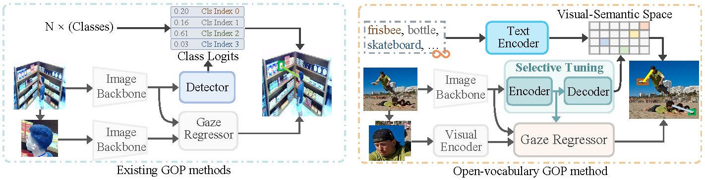
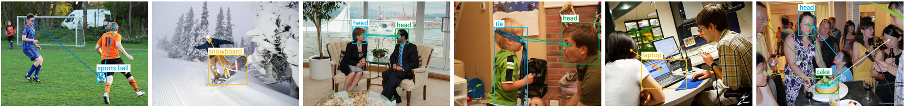
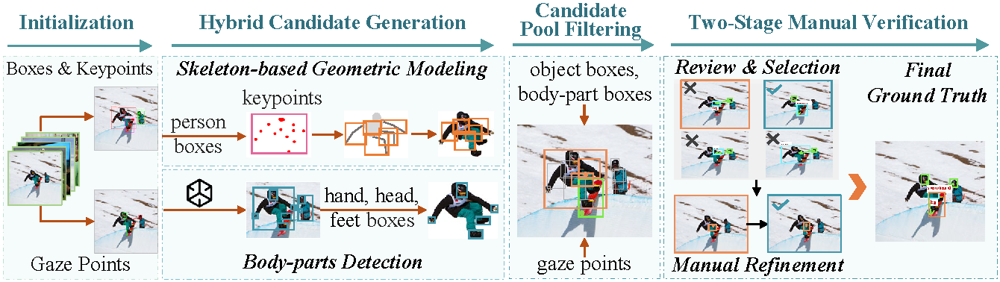

# Open-Vocabulary Gaze Object Prediction

Official repository for **Open-Vocabulary Gaze Object Prediction: Benchmark and Method**, accepted by **ACM Multimedia 2026**.

We introduce **DiSG (Diverse Scenes for Gaze Object Prediction)**, an in-the-wild benchmark for open-vocabulary gaze object prediction, together with an OVGOP framework for localizing and recognizing gaze targets under a free-form category vocabulary.

- 📄 **Paper:** Accepted by ACM Multimedia 2026; official link coming soon
- 📦 **Dataset:** [Google Drive](https://drive.google.com/file/d/1oH4tr66ZQLQvWkJnlaCosyetDs1zOxma/view?usp=sharing) OR [Baidu Netdisk](https://pan.baidu.com/s/1aD86VRsDN9ki22WyIT8i5Q?pwd=disg) (access code: `disg`)
- 🧭 **Base/Novel split:** Included in the dataset annotations and described below
- 💻 **Code and model weights:** Will be released as soon as possible

  <a href="#disg-dataset">📚 DiSG Dataset</a> ·
  <a href="#download">⬇️ Download</a> ·
  <a href="#annotation-format">🧾 Annotation Format</a> ·
  <a href="#license">⚖️ License</a>

  

<em>Conventional GOP operates on a fixed category vocabulary, while OVGOP supports gaze-object prediction with free-form category prompts.</em>

## News

- **2026-07-16** — The DiSG dataset was made available through Google Drive and Baidu Netdisk.
- **2026-07-10** — Our paper was accepted by ACM Multimedia 2026.

---

## Introduction

Gaze Object Prediction (GOP) connects human attention to scene semantics by localizing and recognizing the object a person is looking at. Existing GOP benchmarks and methods are generally designed around a fixed set of categories, which limits their ability to handle rare or previously unsupervised gaze targets in real-world scenes.

Open-Vocabulary Gaze Object Prediction (OVGOP) removes this fixed-vocabulary assumption. Given an image, a set of head locations, and a free-form category vocabulary, the task is to localize the object attended to by each person and predict its semantic category, including categories held out from task-specific training.

This project provides:

- **DiSG**, a real-image benchmark with diverse human-centric scenes, object categories, and fine-grained body-part categories.
- A standardized **Base/Novel split** for open-vocabulary GOP evaluation.
- An **OVGOP framework** that combines text-driven object discovery, gaze-guided spatial selection, and spatial-semantic disambiguation.

## DiSG Dataset

DiSG is constructed for open-vocabulary gaze object prediction in diverse, real-world scenes. It combines common object categories with fine-grained human body-part categories, enabling evaluation beyond coarse person-level gaze targets.

  

<em>Illustrative DiSG gaze-object annotations across diverse scenes, common objects, and fine-grained body parts.</em>

### Dataset Statistics

| Statistic | Value |
| --- | ---: |
| Images | 13,041 |
| Gaze-object annotations | 17,447 |
| Categories | 86 |
| Base categories | 60 |
| Novel categories | 26 |

The released validation annotation contains **2,781 images**, **3,700 gaze-object annotations**, and all **86 categories**.

## Data Construction

DiSG is built from the intersection of **COCO** and **GazeFollow**, inheriting object bounding boxes, human keypoints, and gaze annotations as initialization. Automatic candidate generation is followed by filtering, manual review, and target-box refinement.

  

Object and body-part candidates are generated automatically, then pruned using the ground-truth gaze point for manual review. Annotators review and refine the candidates, and the final gaze-object ground truth is determined by majority agreement.

## Base/Novel Split

DiSG defines a hybrid Base/Novel split over all 86 categories:

| Category source | Base (`seen`) | Novel (`unseen`) | Total |
| --- | ---: | ---: | ---: |
| COCO object categories | 57 | 23 | 80 |
| Human body-part categories | 3 | 3 | 6 |
| **Total** | **60** | **26** | **86** |

The six body-part categories are split as follows:

- Base: `head`, `hand`, `leg`
- Novel: `foot`, `arm`, `torso`

Base categories are used for task-specific training and validation. Novel categories are held out from box-level supervision during DiSG task-specific training and are evaluated on the validation set using category-name prompts.

## Download

The DiSG package is available from two download mirrors:

- 🌐 **Google Drive:** [Download DiSG](https://drive.google.com/file/d/1oH4tr66ZQLQvWkJnlaCosyetDs1zOxma/view?usp=sharing)
- ☁️ **Baidu Netdisk:** [Download DiSG](https://pan.baidu.com/s/1aD86VRsDN9ki22WyIT8i5Q?pwd=disg) — access code: `disg`

> [!TIP]
> Choose the mirror that is most convenient for your region. Both links provide the same DiSG dataset release.

> DiSG is derived from COCO and GazeFollow. Source images, inherited annotations, and related dataset components remain subject to their respective upstream licenses and terms of use. The DiSG release does not grant additional rights beyond those terms, and users are responsible for complying with the applicable COCO and GazeFollow requirements.

## Data Preparation

1. Download the DiSG package from the link above.
2. Extract the package into a local data directory.
3. Keep the provided training and validation annotation files unchanged when reproducing the official benchmark split.
4. Use the `ov_setting` field in `categories` to distinguish Base (`seen`) and Novel (`unseen`) categories.

## Annotation Format

DiSG uses a COCO-compatible JSON structure, and the training and validation annotations share the same schema:

- `images`: image IDs, file names, and dimensions
- `annotations`: standard COCO object-detection and segmentation annotations
- `annotations_gaze`: gaze-object instances, including the gaze point, target box, head box, person box, target category, and source metadata
- `categories`: category names, and `ov_setting` (`seen` for Base and `unseen` for Novel)

Bounding boxes use the COCO convention `[x, y, width, height]`, and all coordinates are expressed in image pixels.

## Code and Model Release

The current repository release focuses on the **DiSG dataset and its Base/Novel split**.

The following components will be released as soon as possible:

- OVGOP model implementation
- Model weights

## Citation

The final BibTeX entry and `CITATION.cff` will be added after the camera-ready publication metadata, author order, and official paper URL are confirmed.

## License

The repository's original code is licensed under the [Apache License 2.0](LICENSE), unless stated otherwise.

The DiSG dataset is derived from COCO and GazeFollow. Source images, inherited annotations, and related dataset components remain governed by their respective upstream licenses and terms of use and are not covered by the repository's Apache License 2.0. Users must comply with the applicable COCO and GazeFollow requirements.

## Acknowledgements

DiSG is constructed using resources from COCO and GazeFollow. The proposed method also builds on open-vocabulary object detection and vision-language modeling research. We thank the maintainers and contributors of these projects.
